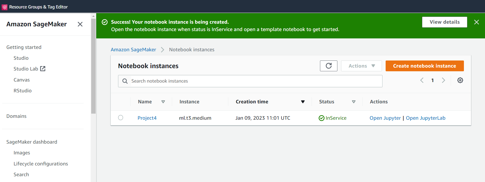
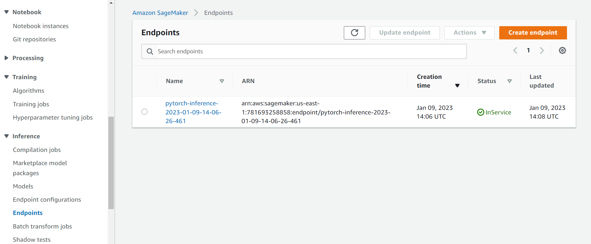
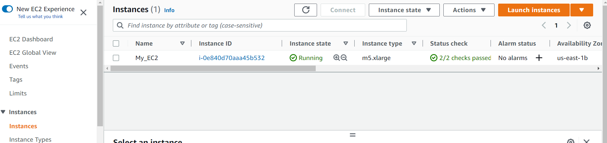
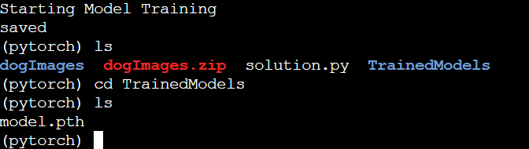
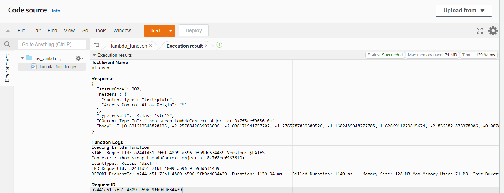
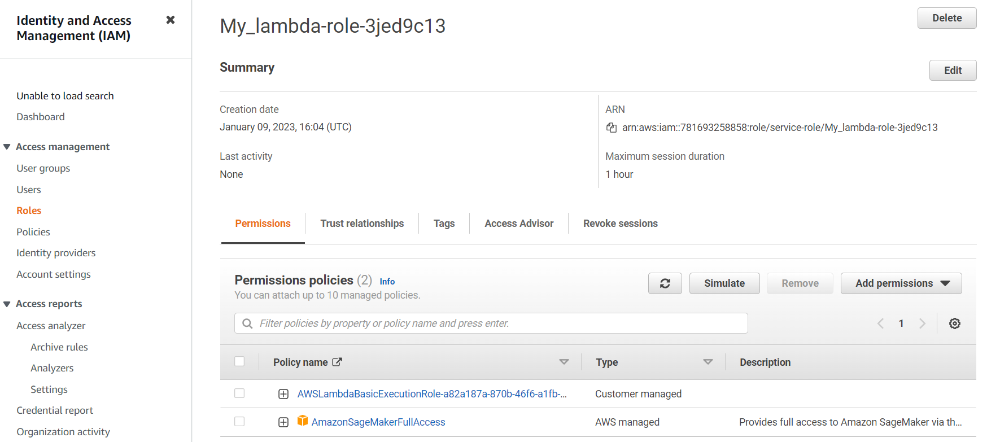
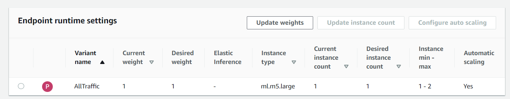

## Writeup describing the decisions made during the project and justifications

# Instance Setup
The instance type I selected is ml.t3.medium, which is a spot instance with relative low cost of $0.0125 per hour and high computing power.
.

# S3 Setup
.

# Endpoint Deployed
.

# EC2 Setup
The instance type I first selected is one of the accelerated computing instances, as Deep Learning AMI GPU PyTorch only support one of the follwing instance types: G3, P3, P3dn, P4d, G5, G4dn. However none of these are supported by Udacity student account.

I finally selected m5.xlarge as the price is quite low compared to other instances types listed above, $0.192 per Hour. It has vCPU of 4 and Memory of 16 GiB.
.

Check the trained and saved model in EC2.
.

# Compare ec2train1.py and train_and_deploy_solution.ipynb
There are modules specificaly used in SageMaker, but not in EC2, such as:sagemaker.pytorch, sagemaker.tuner, sagemaker.debugger, sagemaker.predictor. In EC2 instance, the training code use the following modules to train:torch.nn, torch.optim, torchvision.models, torchvision.transforms.

In addition, train_and_deploy_solution.ipynb works with hpo.py to perform hyperparameter tuning and find the best parameters.In EC2 instance, the best hyperparameter of batch size and learning is hardcoded, which were found from train_and_deploy_solution.ipynb Best estimator.

# Lambda Function Setup
lambda_handler defines a function which can apply event(in this case, dog images) to a deployed endpoint. Then returning an inference, which gives prediction of dog images that specified in test.

# Lambda Testing Result
.

# IAM Security
Add Sagemaker Full Access Policy to the lambda role. However, attaching Full Access policy violates the rule of 'least permission', which may lead to security issues. In addition, there is an old customer managed policy 'AWSLambdaBasicExecutionRole-d9f7176d-86c9-41d6-bc6c-41be07774973' not being activly used in the lambda function. This may lead to vulnerabilities because they may belong to people who are no longer working on the project and who may not be careful about ensuring the project's success. It should be deleted.
.

# Concurrency and Auto-scaling
For Lambda concurrency, reserved concurrency has lower cost but no longer available in the latest version. To save cost, I selected 2 provisioned concurrency, which is $2.79 per month in addition to pricing for duration and requests.

For Endpoint auto-scaling, I've selected 2 as max number of instance to save cost. 30s for both scale in and scale out cool down to get quick response. Target value is set for 50, so that where there are 50 request recived nearly simultaneously, it will then triger another instance.
.